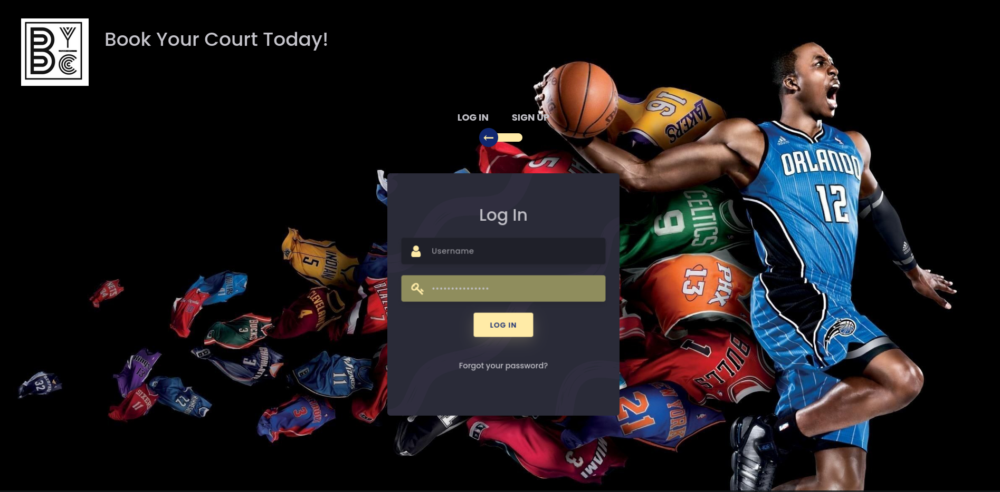

# PWP SPRING 2022
# BYC - Book Your Court



# Group information
* Student 1. Huong Nguyen _(Huong.Nguyen@oulu.fi)_
* Student 2. Vandana Yadav _(vandana.mj24@gmail.com)_

# Setup

### Install required packages
```
# Python version: 3.7.6
pip install -r requirements.txt 
```

# Run and Test
1. Open terminal
2. Make bash files executable
```
chmod +x run.sh
chmod +x delete_db.sh
```

3. If db/ folder does not exist, create the new one before running the program. Otherwise, skip this step.
```
mkdir db
```

4. Run the program (auto generate table)
```
# Option 1: Auto populate database
./run.sh -p true 

# Option 2: Not populate database
./run.sh -p false 
```

5. Open your browser and access 127.0.0.1:5000
6. Delete all tables and database whenever you want by executing
```
./delete_db.sh
```

# Useful links
- [Online APIs documentation](https://book-your-court.herokuapp.com/apidocs/)
