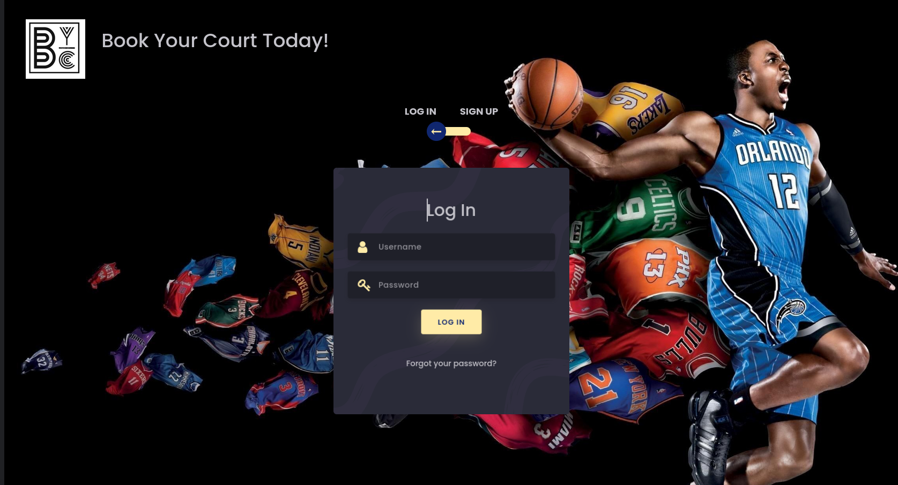

# PWP SPRING 2022
# BYC - Book Your Court



# Group information
* Student 1. Huong Nguyen _(Huong.Nguyen@oulu.fi)_
* Student 2. Vandana Yadav _(vandana.mj24@gmail.com)_

# Setup

### Install required packages
```
# Python version: 3.7.6
pip install -r requirements.txt 
```

# Run and Test

```
1. python run.py
2. Open your browser and access 127.0.0.1:5000
```

[//]: # (_Remember to include all required documentation and HOWTOs, including how to create and populate the database, how to run and test the API, the url to the entrypoint and instructions on how to setup and run the client_)
